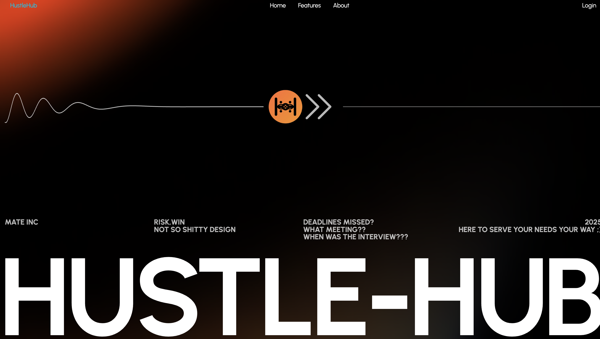

<h1 align="center">
  
  Hustle Hub
</h1>

Hustle-Hub is a web application designed to help users track job applications, manage networking contacts, schedule meetings, and analyze progress—all in one place.  
Its intuitive dashboard makes it easy to stay organized and on top of your career journey.

## Features

- Track job applications with status updates
- Manage networking contacts and interaction history
- Schedule meetings and receive reminders
- Visualize application progress and statistics

## License

This project is licensed under the [MIT License](LICENSE).

---
